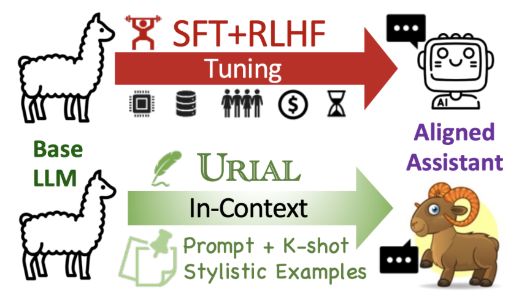

# URIAL: Untuned LLMs with Restyled In-context Alignment 

> This is part of the Re-Align project by AI2 Mosaic. Please find more information on our website: [https://allenai.github.io/re-align/](https://allenai.github.io/re-align/index.html).

URIAL is a simple, *tuning-free* alignment method, URIAL (**U**ntuned LLMs with **R**estyled **I**n-context **AL**ignment). URIAL achieves effective alignment purely through in-context learning (ICL), requiring as few as three constant stylistic examples and a system prompt for achieving a comparable performance with SFT/RLHF.



## URIAL Prompts 

 
<details>
<summary> 🖼️ Click here to see a figure to illustrate URIAL and other ICL Alignment methods.</summary>

</details>


### Content
As discussed [here](https://allenai.github.io/re-align/urial.html), a URIAL Prompt consists of K-shot stylistic in-context examples and a system prompt. The folder [`urial_prompts`](urial_prompts/) contains:

- `URIAL-main (K=3; 1k tokens)`  -> [`inst_1k.txt`](urial_prompts/inst_1k.txt)
- `URIAL-main (K=8; 2k tokens)`  -> [`inst_2k.txt`](urial_prompts/inst_2k.txt)
- `URIAL-main (K=1; 0.5k tokens)`  -> [`inst_1shot.txt`](urial_prompts/inst_1shot.txt)
- `URIAL-ablation (K=3; 1k tokens)`  -> [`inst_1k_v2.txt`](urial_prompts/inst_1k_v2.txt)
- `URIAL-ablation (K=0; 0.15k tokens)`  -> [`inst_only.txt`](urial_prompts/inst_only.txt)

<!-- - [`Retrieval ICL`](urial_prompts/inst_only.txt) -->


## Installation

```bash
conda create -n re_align python=3.10
pip install -r requirements.txt
```

## URIAL Inference

Below we show an example of how to run inference experiments with URIAL prompts on :
- Base LLM: `mistralai/Mistral-7B-v0.1`
- Dataset: `just_eval` -> [**re-align/just-eval-instruct**](https://huggingface.co/datasets/re-align/just-eval-instruct)  on 🤗 Hugging Face.

```bash
version="inst_1k"
output_dir="result_dirs/urial/${version}/"
python src/infer.py \
        --interval 1 \
        --model_path "mistralai/Mistral-7B-v0.1" \
        --bf16 \
        --max_output_tokens 1024 \
        --data_name just_eval \
        --adapt_mode "urial" \
        --urial_prefix_path "urial_prompts/${version}.txt" \
        --repetition_penalty 1.1 \
        --output_folder $output_dir
```

Supported models include:
- `meta-llama/Llama-2-7b-hf`
- `TheBloke/Llama-2-70B-GPTQ` with `--gptq` flag.
- other similar models on huggingface.co

👀 More will come with the support of [vLLM](https://github.com/vllm-project/vllm). Please stay tuned!


<!-- <details>
  <summary>Data Parallel on Multiple GPUs</summary>

```bash 
n_shards=4 
shard_size=250
start_gpu=0
version="inst_1k"
output_dir="result_dirs/urial/${version}/"

for ((start = 0, end = (($shard_size)), gpu = $start_gpu; gpu < $n_shards+$start_gpu; start += $shard_size, end += $shard_size, gpu++)); do
    CUDA_VISIBLE_DEVICES=$gpu python src/infer.py \
        --interval 1 \
        --model_path "mistralai/Mistral-7B-v0.1" \
        --bf16 \
        --max_output_tokens 1024 \
        --data_name just_eval \
        --start_index $start --end_index $end \
        --adapt_mode "urial" \
        --urial_prefix_path "urial_prompts/${version}.txt" \
        --repetition_penalty 1.1 \
        --output_folder $output_dir & 
done


python src/scripts/merge_results.py $output_dir ${model_name}
```
</details> -->


## Evaluation with Just-Eval 

Please find more details about our evaluation here: [https://github.com/Re-Align/just-eval](https://github.com/Re-Align/just-eval)

### Installation of Just-Eval 
```
pip install git+https://github.com/Re-Align/just-eval.git
export OPENAI_API_KEY=<your secret key>
```

### Reformatting output data 
For example, if the output data is `result_dirs/urial/inst_1k/Mistral-7B-v0.1.json`, then run the following command to reformat the output data to `result_dirs/urial/inst_1k/Mistral-7B-v0.1.to_eval.json`.
```bash  
python src/scripts/reformat.py result_dirs/urial/inst_1k/Mistral-7B-v0.1.json
```

### Run Scoring 
```bash
to_eval_file="result_dirs/urial/inst_1k/Mistral-7B-v0.1.to_eval.json"
run_name="Mistral-URIAL"
# GPT-4 for first five aspects on 0-800 examples 
just_eval \
    --mode "score_multi" \
    --model "gpt-4-0314" \
    --start_idx 0 \
    --end_idx 800 \
    --first_file $to_eval_file \
    --output_file "result_dirs/just-eval_results/${run_name}.score_multi.gpt-4.json"

# GPT-3.5-turbo for the safety aspect on 800-1000 examples
just_eval \
        --mode "score_safety" \
        --model "gpt-3.5-turbo-0613" \
        --first_file $to_eval_file \
        --start_idx 800 --end_idx 1000 \
        --output_file "result_dirs/just-eval_results/${run_name}.score_safety.chatgpt.json"  
```


## Analyze with Token-distribution Analysis 

👀 Code will be added here soon. Please stay tuned! 
💻 Please look at the web demos here for now: [https://allenai.github.io/re-align/tds.html](https://allenai.github.io/re-align/tds.html)
  
## Citation 

```bibtex
@article{Lin2023ReAlign,
    author = {Bill Yuchen Lin and Abhilasha Ravichander and Ximing Lu and Nouha Dziri and Melanie Sclar and Khyathi Chandu and Chandra Bhagavatula and Yejin Choi},
    journal = {ArXiv preprint},
    title = {The Unlocking Spell on Base LLMs: Rethinking Alignment via In-Context Learning},
    year = {2023}
}
```
