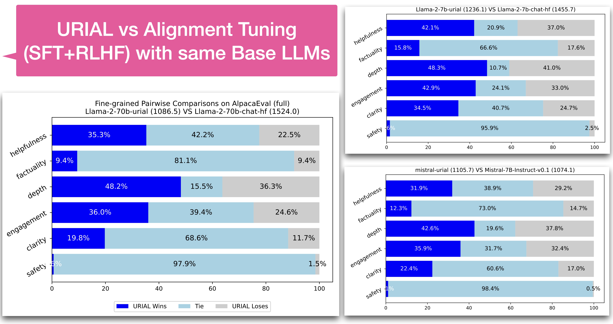
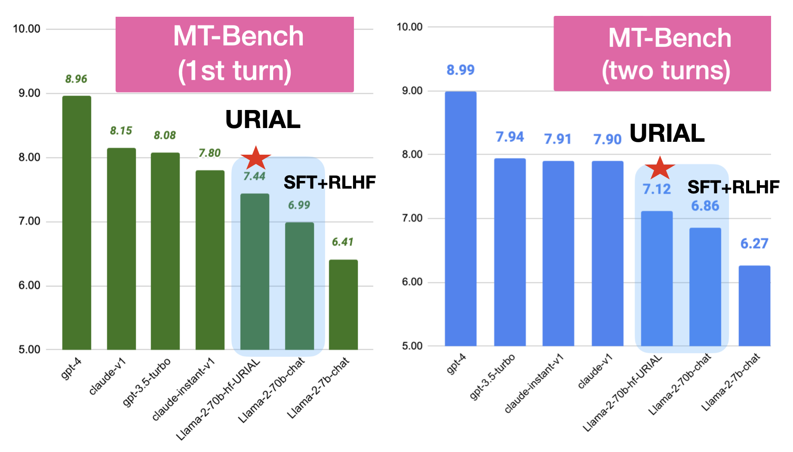

# URIAL: Untuned LLMs with Restyled In-context Alignment (ICLR'24: Rethinking Alignment via ICL)

> This is part of the **Rethinking Alignment** (Re-Align) project by AI2 Mosaic. 

> **📑 Paper**: "[The Unlocking Spell on Base LLMs: Rethinking Alignment via In-Context Learning](https://arxiv.org/abs/2312.01552)" (**ICLR 2024**).

> **🛜 Website**: [https://allenai.github.io/re-align/](https://allenai.github.io/re-align/index.html).

URIAL is a simple, *tuning-free* alignment method, URIAL (**U**ntuned LLMs with **R**estyled **I**n-context **AL**ignment). URIAL achieves effective alignment purely through in-context learning (ICL), requiring as few as three **__constant__** stylistic examples and a system prompt.
It's a strong baseline method for LLM alignment and shows comparable performance to fine-tuning based alignment. 
Apart from that, URIAL can also be used to study the science of LLMs, helping to understand alignment in a more controlled and interpretable manner.

<!-- align center the image -->
 


## Installation

```bash
conda create -n urial python=3.10
conda activate urial
pip install -r requirements.txt
```

## URIAL Inference

An example script for running mistral (base) with urial prompts for `alpaca_eval`:

```bash  
urial="inst_1k_v4" # urial prompt name -->  `urial_prompts/{urial}.txt`
output_dir="result_dirs/alpaca_eval/vllm_urial=${urial}/"  
CUDA_VISIBLE_DEVICES=0 python src/unified_infer.py \
    --urial $urial \
    --engine vllm \
    --model_name "mistralai/Mistral-7b-v0.1" \
    --tensor_parallel_size 1 \
    --dtype bfloat16 \
    --data_name "alpaca_eval" \
    --top_p 1.0 --temperature 0.3 --repetition_penalty 1.1 \
    --batch_size 16 --max_tokens 2048 \
    --output_folder $output_dir/
```

For more details, please refer to  [`URIAL/src/unified_infer.py`](src/unified_infer.py).  Note that you can use the same method to run inference with aligned LLMs (by not setting `--urial`) too and also for other datasets. You could customize your own data/models in [`URIAL/src/unified_utils.py`](src/unified_utils.py).


<!-- <details><summary> legacy method </summary>


Below we show an example of how to run inference experiments with URIAL prompts on :
- Base LLM: `mistralai/Mistral-7B-v0.1`
- Dataset: `just_eval` -> [**re-align/just-eval-instruct**](https://huggingface.co/datasets/re-align/just-eval-instruct)  on 🤗 Hugging Face.

```bash
version="inst_1k"
output_dir="result_dirs/urial/${version}/"
python src/legacy/infer.py \
        --interval 1 \
        --model_path "mistralai/Mistral-7B-v0.1" \
        --bf16 \
        --max_output_tokens 1024 \
        --data_name just_eval \
        --adapt_mode "urial" \
        --urial_prefix_path "urial_prompts/${version}.txt" \
        --repetition_penalty 1.1 \
        --output_folder $output_dir
```

Supported models include:
- `meta-llama/Llama-2-7b-hf`
- `TheBloke/Llama-2-70B-GPTQ` with `--gptq` flag.
- other similar models on huggingface.co

</details> -->


<!-- <details>
  <summary>Data Parallel on Multiple GPUs</summary>

```bash 
n_shards=4 
shard_size=250
start_gpu=0
version="inst_1k"
output_dir="result_dirs/urial/${version}/"

for ((start = 0, end = (($shard_size)), gpu = $start_gpu; gpu < $n_shards+$start_gpu; start += $shard_size, end += $shard_size, gpu++)); do
    CUDA_VISIBLE_DEVICES=$gpu python src/infer.py \
        --interval 1 \
        --model_path "mistralai/Mistral-7B-v0.1" \
        --bf16 \
        --max_output_tokens 1024 \
        --data_name just_eval \
        --start_index $start --end_index $end \
        --adapt_mode "urial" \
        --urial_prefix_path "urial_prompts/${version}.txt" \
        --repetition_penalty 1.1 \
        --output_folder $output_dir & 
done


python src/scripts/merge_results.py $output_dir ${model_name}
```
</details> -->


### URIAL: ICL with constant prompts

 
<details>
<summary> 🖼️ Click here to see a figure for the illustration of URIAL and other tuning-free Alignment methods.</summary>

</details>


### Versions
As discussed [here](https://allenai.github.io/re-align/urial.html), a URIAL Prompt consists of K-shot stylistic in-context examples and a system prompt. The folder [`urial_prompts`](urial_prompts/) contains:

Suggested versions:
- [`inst_1k_v4.help`](urial_prompts/inst_1k_v4.help.txt.md) (no refusal; K=3 examples; ~1k tokens)
- [`inst_1k_v4`](urial_prompts/inst_1k_v4.txt.md) (safer;  K=3 examples; ~1k tokens)


<details><summary> Previous versions (used for the experiments in the arXiv version).</summary>

- `URIAL-main (K=3; 1k tokens)`  -> [`inst_1k.txt`](urial_prompts/inst_1k.txt)
- `URIAL-main (K=8; 2k tokens)`  -> [`inst_2k.txt`](urial_prompts/inst_2k.txt)
- `URIAL-main (K=1; 0.5k tokens)`  -> [`inst_1shot.txt`](urial_prompts/inst_1shot.txt)
- `URIAL-ablation (K=3; 1k tokens)`  -> [`inst_1k_v2.txt`](urial_prompts/inst_1k_v2.txt)
- `URIAL-ablation (K=0; 0.15k tokens)`  -> [`inst_only.txt`](urial_prompts/inst_only.txt)

</details>
<!-- - [`Retrieval ICL`](urial_prompts/inst_only.txt) -->


## Evaluation 

### AlpacaEval (fine-grained pairwise evaluation)
 



<details><summary> Show Tables</summary>

------------------------------------------------------------------------------------------------------------------------
`mistral-urial (#char=1105.7) VS Mistral-7B-Instruct-v0.1 (#char=1074.1) ⬇️`
| model               |   helpfulness |   factuality |   depth |   engagement |   clarity |   safety |
|---------------------|---------------|--------------|---------|--------------|-----------|----------|
| mistral-urial Win:  |         31.93 |        12.30 |   42.61 |        35.90 |     22.36 |     1.12 |
| mistral-urial Tie:  |         38.88 |        73.04 |   19.63 |        31.68 |     60.62 |    98.39 |
| mistral-urial Lose: |         29.19 |        14.66 |   37.76 |        32.42 |     17.02 |     0.50 |
------------------------------------------------------------------------------------------------------------------------


`Llama-2-7b-urial (#char=1236.1) VS Llama-2-7b-chat-hf (#char=1455.7) ⬇️`
| model                  |   helpfulness |   factuality |   depth |   engagement |   clarity |   safety |
|------------------------|---------------|--------------|---------|--------------|-----------|----------|
| Llama-2-7b-urial Win:  |         42.11 |        15.78 |   48.32 |        42.86 |     34.53 |     1.61 |
| Llama-2-7b-urial Tie:  |         20.87 |        66.58 |   10.68 |        24.10 |     40.75 |    95.90 |
| Llama-2-7b-urial Lose: |         37.02 |        17.64 |   40.99 |        33.04 |     24.72 |     2.48 |
------------------------------------------------------------------------------------------------------------------------

`Llama-2-70b-urial (#char=1086.5) VS Llama-2-70b-chat-hf (#char=1524.0) ⬇️`
| model                   |   helpfulness |   factuality |   depth |   engagement |   clarity |   safety |
|-------------------------|---------------|--------------|---------|--------------|-----------|----------|
| Llama-2-70b-urial Win:  |         35.28 |         9.44 |   48.20 |        36.02 |     19.75 |     0.62 |
| Llama-2-70b-urial Tie:  |         42.24 |        81.12 |   15.53 |        39.38 |     68.57 |    97.89 |
| Llama-2-70b-urial Lose: |         22.48 |         9.44 |   36.27 |        24.60 |     11.68 |     1.49 |

</details>

**Scripts for URIAL/Aligned inference**: [`run_scripts/alpaca_eval`](run_scripts/alpaca_eval/)

**Evaluation**: 
- [`evaluate/README.md`](evaluate/README.md)
- [Template for evaluation](evaluate/eval_template_pairwise.md)


### MT-Bench




| model             |   Turn 1 |   Turn 2 |   Overall |
|:------------------|---------:|---------:|----------:|
| `gpt-4`             |     8.96 |     9.03 |      8.99 |
| `gpt-3.5-turbo`     |     8.07 |     7.81 |      7.94 |
| `Llama-2-70b-hf`    |     7.61 |     6.61 |      7.11 |
| `Mixtral-8x7B-v0.1` |     7.69 |     6.19 |      6.94 |
| `Mistral-7b-v0.1 `  |     7.49 |     5.86 |      6.67 |
| `Yi-34B`            |     7.19 |     6.16 |      6.67 |
| `phi-2`             |     7.04 |     4.66 |      5.85 |
| `Llama-2-13b-hf `   |     6.27 |     4.41 |      5.34 |
| `Yi-6B `            |     5.96 |     3.99 |      4.97 |
| `Llama-2-7b-hf `    |     5.75 |     3.91 |      4.83 |
| `olmo-7b`              |     3.95 |     2.86 |      3.41 |


### Just-Eval 

Please find more details about our evaluation here: [https://github.com/Re-Align/just-eval](https://github.com/Re-Align/just-eval).

<details><summary> show more (the below content is outdated; will be updated soon) </summary>

#### Installation of Just-Eval 
```bash
pip install git+https://github.com/Re-Align/just-eval.git
export OPENAI_API_KEY=<your secret key>
```

#### Reformatting output data 
For example, if the output data is `result_dirs/urial/inst_1k/Mistral-7B-v0.1.json`, then run the following command to reformat the output data to `result_dirs/urial/inst_1k/Mistral-7B-v0.1.to_eval.json`.
```bash  
python src/scripts/reformat.py result_dirs/urial/inst_1k/Mistral-7B-v0.1.json
```

#### Run Scoring 
```bash
to_eval_file="result_dirs/urial/inst_1k/Mistral-7B-v0.1.to_eval.json"
run_name="Mistral-URIAL"
# GPT-4 for first five aspects on 0-800 examples 
just_eval \
    --mode "score_multi" \
    --model "gpt-4-0314" \
    --start_idx 0 \
    --end_idx 800 \
    --first_file $to_eval_file \
    --output_file "result_dirs/just-eval_results/${run_name}.score_multi.gpt-4.json"

# GPT-3.5-turbo for the safety aspect on 800-1000 examples
just_eval \
        --mode "score_safety" \
        --model "gpt-3.5-turbo-0613" \
        --first_file $to_eval_file \
        --start_idx 800 --end_idx 1000 \
        --output_file "result_dirs/just-eval_results/${run_name}.score_safety.chatgpt.json"  
```

</details>

<!-- 
## Analyze with Token-distribution Analysis 

👀 Code will be added here soon. Please stay tuned! 
💻 Please look at the web demos here for now: [https://allenai.github.io/re-align/tds.html](https://allenai.github.io/re-align/tds.html)
   -->

## Citation 

```bibtex
@inproceedings{
    Lin2024ReAlign,
    title={The Unlocking Spell on Base LLMs: Rethinking Alignment via In-Context Learning},
    author={Bill Yuchen Lin and Abhilasha Ravichander and Ximing Lu and Nouha Dziri and Melanie Sclar and Khyathi Chandu and Chandra Bhagavatula and Yejin Choi},
    booktitle={International Conference on Learning Representations},
    year={2024},
    url={https://arxiv.org/abs/2312.01552}
}
```
